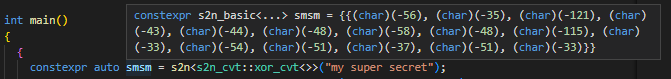
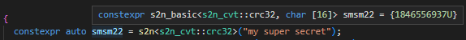

# String to Number (s2n)
A single header library for string manipulation/hashing/encryption.  

## Features:
* Single header file (`.hpp`) which could be included in any project
* Zero dependency, no other headers are included, even from the standard ones
* Compile-time library, all functions are marked `constexpr`
* Provides a generic (`template`) interface to allow integration with different string manipulation/encryption implementations
* Supports language versions `C++14` and above
* Compare the encrypted data with the natural `==` operator

## Use cases:
* Hiding plain/harcoded strings inside an application, making it much harder to inspect the binary via an assembly debugger
* Converting strings to other numeric forms with 0-cost at runtime, since the conversion is done during compilation.  
  In a rich IDE, you can immediately see the result by hovering over the `constexpr` variable holding the conversion result  
    
    

## Quick usage example:
```c++
// this is the only file you need to include

// the library depends on the standard macro __cplusplus
// but you can override it with the macro "S2N_CPP_VERSION" which is optional
// when used, it must be set to the actual C++ language version used by the compiler

//#define S2N_CPP_VERSION 201402L
#include "str-to-num.hpp"

// std::cout
#include <iostream>
// size_t
#include <cstddef>

// compare the decrypted strings (using plain C-style arrays)
template<typename Ta, typename Tb, size_t N>
constexpr bool same_str_data(const Ta (&str_a) [N], const Tb (&str_b) [N]) {
  for (size_t idx = 0; idx < N; ++idx) {
    if (str_a[idx] != str_b[idx]) {
      return false;
    }
  }
  return true;
}

// compare the decrypted strings (using the returned string container instance)
template<typename Ta, typename Tb>
constexpr bool same_str_data(const Ta &str_a, const Tb &str_b) {
  if (str_a.count != str_b.count) {
    return false;
  }

  for (size_t idx = 0; idx < str_a.count; ++idx) {
    if (str_a.data[idx] != str_b.data[idx]) {
      return false;
    }
  }
  return true;
}

int main()
{
  // create strings encrypted with a simple XOR operation (struct s2n_cvt::xor_cvt)
  constexpr auto my_text_xored = s2n("my super secret"); // defaults to using XOR converter
  constexpr auto my_text = s2n< s2n_cvt::xor_cvt<> >("my super secret"); // manually specifying the XOR converter
  constexpr auto my_text_again = s2n< s2n_cvt::xor_cvt<> >("my super secret"); // we'll use this for later comparison

  constexpr auto my_text_wide = s2n< s2n_cvt::xor_cvt<> >(L"my super secret"); // wide char
  // additionaly you can specify a custom XOR key
  constexpr auto my_text_u8 = s2n< s2n_cvt::xor_cvt<288> >(u8"my super secret"); // u8 char + custom XOR key
  constexpr auto my_text_u16 = s2n< s2n_cvt::xor_cvt<__TIME__[7] * __TIME__[6]> >(u"my super secret"); // u16 + custom XOR key
  
   // comparison is based on:
   // 1. original strings length
   // 2. applying the natural operator '==' on each corresponding element (in encrypted form),
   //    might return false positive if the encryption is weak
  static_assert(my_text_again == my_text, "error"); // compare the encrypted data, not the original str
  
  // can_convert_to_str() will be 'true' if the converter supports recovering back the string
  static_assert(my_text.can_convert_to_str, "error");
  static_assert(my_text_wide.can_convert_to_str, "error");
  // .str() will only be available if the provided converter can recover back the original string
  // the decryption is only performed when this function is called, no unencrypted data is saved
  static_assert(same_str_data(my_text.str().data, "my super secret"), "error"); // C-style array
  static_assert(same_str_data(my_text.str(), my_text_wide.str()), "error"); // string container instances
  static_assert(same_str_data(my_text.str(), my_text_u8.str()), "error");
  static_assert(same_str_data(my_text.str(), my_text_u16.str()), "error");

  // prints: my secret string = [my super secret], count=15
  std::cout << "my secret string = [" << my_text.str().data << "], count=" << my_text.str_count << std::endl;
  
  return 0;
}
```
Inspecting this binary via an assembly debugger will not reveal the secret string since it was changed during compilation, the data stored inside the binary is the XOR-ed resulting buffer.  

When the encrypted/manipulated data is changed back to a string, the returned object is a `structure` with 3 members:
1. `count`: the number of characters in the string, **NOT** the bytes (not including the null terminator)
2. `data`: a C-style array with constant size = (`count` + 1), +1 for the null terminator
3. `void clear()`: a function to clear the data buffer manually after usage, ensuring it is not still available on the stack.  
   For `C++20` and above, a `constexpr` destructor is automatically invoked when the decrypted string goes out of scope


## Adding your custom converter
### Mandatory **string-to-number** conversion function
1. Create a `struct`, it could be templated like the built-in `s2n_cvt::xor_cvt`
2. Provide a function called `to_num`, which must satisfy the following:
   - Defined as `constexpr`
   - Have a `static` storage specifier
   - It must return `void`
   - Marked as `noexcept`
   - It must be a templated function with the following template parameters:
     ```c++
     template<typename TStr, s2n_sz_t StrCount, typename TChar>
     ```
     Where:  
     * `TStr`: the type of the original input string, for example: `(const char (&) [5])` a reference to an array of 5 `char` items
     * `StrCount`: the count of characters/array items (not the size in bytes), not including the null terminator
     * `TChar`: the type of the character/array item, ex: `char`, `wchar_t`, `char8_t`, etc...
   - The first parameter of the function must be a reference, whose type is the desired type of the returned value.  
     For example, a `CRC-32` converter would return `uint32_t`, hence the first parameter would be  
     ```c++
     uint32_t &hash
     ```
     An XOR converter might return an array of the same length as the input string
     ```c++
     TChar (&dst) [StrCount]
     ```
     This is a reference to an array of `StrCount` elements, each element has the type `TChar`, notice that this data is coming from the parameters of the function template
    - The second function parameter must be
      ```c++
      const TStr& src
      ```

   Check the built-in converters `s2n_cvt::xor_cvt` and `s2n_cvt::hash_fnv_1a_64` for an actual example

### Optional **number-to-string** conversion function (if your converter supports recovering back the original string)
* Provide a function called `to_str`, which must satisfy the following:
   - Defined as `constexpr`
   - Have a `static` storage specifier
   - It must return `void`
   - Marked as `noexcept`
   - It must be a templated function with the following template parameters:
     ```c++
     template<typename TStr, s2n_sz_t StrCount, typename TChar>
     ```
     Where:  
     * `TStr`: the type of the original input string, for example: `(const char (&) [5])` a reference to an array of 5 `char` items
     * `StrCount`: the count of characters/array items (not the size in bytes), not including the null terminator
     * `TChar`: the type of the character/array item, ex: `char`, `wchar_t`, `char8_t`, etc...
   - The first function parameter must be
     ```c++
     TChar (&dst) [StrCount + 1]
     ```
     This is the destination buffer, allocated by the library, you have to fill with the unencrypted characters/items. It's size is more than the original string by 1 for the null terminator, you don't have to write the null terminator, it is done automatically by the library
    - The second function parameter must be
      ```c++
      const TChar (&src) [StrCount]
      ```
      Which is a reference to the encrypted string

   Check the built-in converter `s2n_cvt::xor_cvt` for an actual example

## Notes
* Static arrays in C/C++ cannot have a 0 size
  ```c++
  char my_array[0]; // compiler error
  ```
  But many hashing algorithms support empty strings (`""`), to workaround this problem the library creates a 1-element array whose value is null `'\0'`  

* Microsoft's compiler doesn't set the proper value for the standard macro `__cplusplus`, you have to add this `/Zc:__cplusplus` to the compiler flags, more info: https://learn.microsoft.com/en-us/cpp/build/reference/zc-cplusplus
* Starting from `C++17` the exception specification for a function (`noexcept`) is a mandatory part for `typedef` statements, and the library takes care of that automatically.  
But if for example you set the macro `S2N_CPP_VERSION` to `201402L` (`C++14`) while the compiler was targeting language version `C++17` or above, this will result in an error since the library would be looking for the function `to_num()` **WITHOUT** `noexcept` specification, which would fail on `C++17` or above.  
Always rely on the standard macro `__cplusplus`, otherwise set the macro `S2N_CPP_VERSION` carefully.

## Built-in converters
* `s2n_cvt::xor_cvt`: simple XOR converter
* `s2n_cvt::crc32`: CRC-32 hash calculator
* `s2n_cvt::hash_fnv_1a_64`: Fowler–Noll–Vo hash calculator (FNV-1a hash variant with parameters adjusted for 64-bits)
